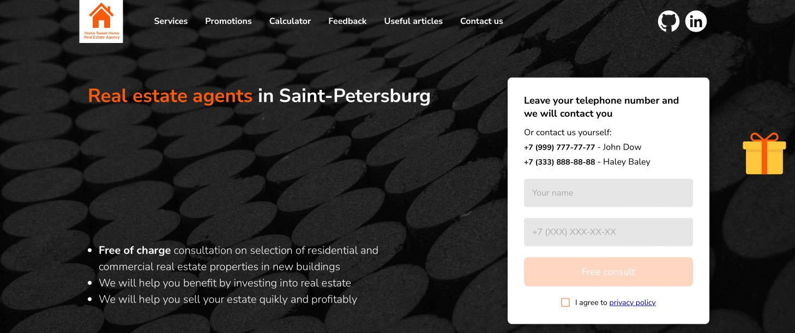

# Real estate agency landing page website

## Fully functional example project written in React JS and native CSS

This project is an English language adaptation of an original russian language version which I wrote as a freelance order for a real estate agency in Saint-Petersburg. This example is fully functional as it is, although the pictures, personal details and namings are replaced with the random ones.

## Brief overview of functionality and purpose

Website like this is designed to attract customers to the specific real estate agency. It contains valuable information on why people should choose this agency over others in the market and so on. So, in order to get attention there are some interactive components included to persuade potential customers to leave their personal info (such as name and telephone number) and ask for a callback. 

Those interactive functionalities are as follows:

* **Giftbox with Lucky Wheel** with prizes. In order to spin it and get a prize client has to leave a phone number which can be used to contact him/her.
* **Callback form.** Normal regular callback form used in a few places of a page, asking client to leave a number if he/she has any questions. It offers free consultation on any matter of interest in regards with agency's field of work.
* **Quiz.** Potential client is offered to take a short questionary regarding the real estate he/she is interested in. It offers free feedback or consultation, prepared specificly for the client depending on the answers that were left in a questionary.
* **Mortage Calculator.** Interactive calculator with few customized range inputs, that allows client to calculate the amount of monthly mortage payment, depending on the total cost of the estate, initial payment, inerest rate and the loan term. Calculator uses annuity formula commonly used on russian real estate market.
* **Feedback carousel.** Carousel with screenshots/cards, containing feedback comments from previous customers.
* **Navbar** that lists and allows navigation throughout key sections of the website.

All the fillable forms have validation and **Privacy Policy** checkbox, so that it complies with personal info handling policy. Submit button only becomes active to be clicked when fields contain data and **Privacy Policy** checkbox is checked.

## Additional libraries and APIs

Brief description on how the project is structured and what additional libraries it uses.

### Telegram API
All the fillable forms collect the information and send it to the **[Telegram Bot API](https://core.telegram.org/bots/api)**.
So the owner of the website gets notified every time the potential client filles out any form or spins the Lucky Wheel or takes a quiz. This is achieved with a regular POST request as described in documentation available via the link above.
**In order to test the messege sender functionality it is necessary to have personal telegram account, telegram channel and a telegram bot.** It is free. But the **project remains functional even without the ability to send messages**. Client will simply get "Sorry, try again later" notification whenever he/she tries to submit any form on the website.

### Axios
In order to send POST requests to the Telegram API I used **[Axios](https://axios-http.com/docs/intro)** library instead of the JS fetch functionality.

Quick start with axios using npm: `npm install axios`. Additional info avaialble via link above.

### Swiper
Feedback cards carousel is configured using **[Swiper](https://swiperjs.com/react)**. Easy to use, a lot of configuration options.

Quick start with swiper using npm: `npm install swiper`. Additional info avaialble via link above.

### Styles
No additional styles libraries are used. I only used native CSS and **module CSS files** to gonfigure the styles.

## Following are the installation tips autogenerated by React

### Getting Started with Create React App

This project was bootstrapped with [Create React App](https://github.com/facebook/create-react-app).

### Available Scripts

In the project directory, you can run:

**`npm start`** - Runs the app in the development mode. Open [http://localhost:3000](http://localhost:3000) to view it in your browser. The page will reload when you make changes. You may also see any lint errors in the console.

**`npm test`** - Launches the test runner in the interactive watch mode. See the section about [running tests](https://facebook.github.io/create-react-app/docs/running-tests) for more information.

**`npm run build`** - Builds the app for production to the `build` folder. It correctly bundles React in production mode and optimizes the build for the best performance. The build is minified and the filenames include the hashes. Your app is ready to be deployed! See the section about [deployment](https://facebook.github.io/create-react-app/docs/deployment) for more information.

**`npm run eject`** - If you aren't satisfied with the build tool and configuration choices, you can `eject` at any time. This command will remove the single build dependency from your project. Instead, it will copy all the configuration files and the transitive dependencies (webpack, Babel, ESLint, etc) right into your project so you have full control over them. All of the commands except `eject` will still work, but they will point to the copied scripts so you can tweak them. At this point you're on your own.

**Note: this is a one-way operation. Once you `eject`, you can't go back!**

You don't have to ever use `eject`. The curated feature set is suitable for small and middle deployments, and you shouldn't feel obligated to use this feature. However we understand that this tool wouldn't be useful if you couldn't customize it when you are ready for it.

### Learn More

You can learn more in the [Create React App documentation](https://facebook.github.io/create-react-app/docs/getting-started). To learn React, check out the [React documentation](https://reactjs.org/).

**Code Splitting** - This section has moved here: [https://facebook.github.io/create-react-app/docs/code-splitting](https://facebook.github.io/create-react-app/docs/code-splitting)

**Analyzing the Bundle Size** - This section has moved here: [https://facebook.github.io/create-react-app/docs/analyzing-the-bundle-size](https://facebook.github.io/create-react-app/docs/analyzing-the-bundle-size)

**Making a Progressive Web App** - This section has moved here: [https://facebook.github.io/create-react-app/docs/making-a-progressive-web-app](https://facebook.github.io/create-react-app/docs/making-a-progressive-web-app)

**Advanced Configuration** - This section has moved here: [https://facebook.github.io/create-react-app/docs/advanced-configuration](https://facebook.github.io/create-react-app/docs/advanced-configuration)

**Deployment** - This section has moved here: [https://facebook.github.io/create-react-app/docs/deployment](https://facebook.github.io/create-react-app/docs/deployment)

**`npm run build` fails to minify** - This section has moved here: [https://facebook.github.io/create-react-app/docs/troubleshooting#npm-run-build-fails-to-minify](https://facebook.github.io/create-react-app/docs/troubleshooting#npm-run-build-fails-to-minify)
